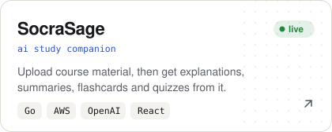
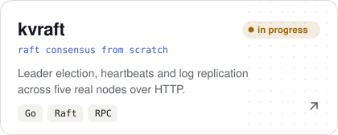
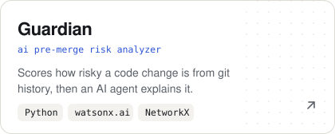
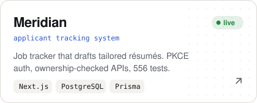

<picture>
  <source media="(prefers-color-scheme: dark)" srcset="./assets/banner-dark.svg">
  
</picture>

  <a href="https://peterukor.com"><picture><source media="(prefers-color-scheme: dark)" srcset="./assets/links/website-dark.svg"></picture></a>
  <a href="https://www.linkedin.com/in/peter-ukor"><picture><source media="(prefers-color-scheme: dark)" srcset="./assets/links/linkedin-dark.svg"></picture></a>
  <a href="mailto:peter@peterukor.com"><picture><source media="(prefers-color-scheme: dark)" srcset="./assets/links/email-dark.svg"></picture></a>

CS + AI at **NJIT**. I build backends, cloud infrastructure and distributed systems, and I like knowing how things work underneath.

### Featured

  <a href="https://socrasage.com"><picture><source media="(prefers-color-scheme: dark)" srcset="./assets/cards/socrasage-dark.svg"></picture></a>
  <a href="https://github.com/peterukor/kvraft"><picture><source media="(prefers-color-scheme: dark)" srcset="./assets/cards/kvraft-dark.svg"></picture></a>

  <a href="https://github.com/peterukor/guardian"><picture><source media="(prefers-color-scheme: dark)" srcset="./assets/cards/guardian-dark.svg"></picture></a>
  <a href="https://github.com/peterukor/meridian_ats"><picture><source media="(prefers-color-scheme: dark)" srcset="./assets/cards/meridian-dark.svg"></picture></a>

SocraSage's code is private; try it live at <a href="https://socrasage.com">socrasage.com</a>. Meridian is live at <a href="https://meridian-1159.vercel.app">meridian-1159.vercel.app</a>.

**Also built:** [AI Lakehouse](https://github.com/peterukor/ai-lakehouse) · [MCL Interpreter](https://github.com/peterukor/mcl-interpreter) · [Plumb Bros](https://github.com/peterukor/plumb-bros) · [SimpleChat](https://github.com/peterukor/simple-chat-app)

### Stack

